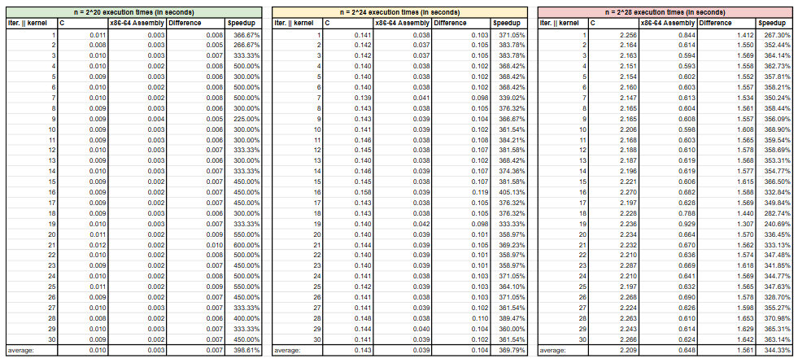

# LBYARCH S17b MCO2 - x86-to-C interface programming project (Vector Distance)

This project utilizes both C and x86-64 assembly kernels in creating a Euclidean distance calculator. The performance of both kernels was compared, mainly through measuring their execution speeds against large data sizes (vectors of n^20, n^24, n^28 elements respectively) in order to evaluate the advantages of x86-64 to C interfacing.

## Project Specifications

## Screenshots of Output

### Correctness Verification
The specifications indicate that the main requirement is to correctly calculate the Euclidean distance of two vectors and store the result in vector z. Using a C function to check for the correctness of the x86-64 kernel implementation, the displayed output shows the same results as each other, as well as the sample test case in the specification, indicating that the implementation is correct.

## Comparison and Analysis of Execution Times

### Execution Time Summary

[Link to the Sheet](https://docs.google.com/spreadsheets/d/1qO1jesfeVPY6tw_yKOHcHxGn2m07CoyijVqteq5KIDU/edit?usp=sharing)

### Performance Interpretation and Conclusions
After running each kernel against vector sizes of 2^20, 2^24, and 2^28 30 times, there is a clear performance increase when interfacing with x86-64 compared to implementing the function in C, as consistently shown by the data: interfacing in c showed a 398.61% decrease in average execution time for vector size n = 2^20, a 369.79% decrease for size n = 2^24, and a 344.33% decrease for size n = 2^28. 

Interestingly, there is a noticeable decrease in speedup as the problem size (n) increases, with the improvement of execution time lessening by 28.83% when the problem size increases from 2^20 to 2^24, and 25.45% when increased from 2^24 - 2^28, so while interfacing with x86-assembly is shown to improve the efficiency of the Euclidean distance function, the difference becomes less and less significant the bigger the memory requirement.

This is likely due to memory wall limitations as the size increases. As n increases, the data that the program needs to access grows larger than the cache size, causing cache misses and requiring the CPU to retrieve data from the main memory. Overall, x86-64 interfacing can significantly boost efficiency for many problems; however, it becomes the programmer's job to assess which cases necessitate its use and which are better off being programmed without any interfacing.

## Instructions to Build and Run Program

### Pre-requisites
Ensure the following tools are installed and available in PATH:

- GCC (MinGW-w64)
- NASM assembler

You may check your installation by executing "gcc --version" and "nasm --version" in your terminal

### Building the Program
open the terminal and run the provided batch file `run.bat`. This script will take care of the following:
- Compiling the C file
- Assembling the .asm file
- linking everything into the final executable: `calculateVectorDistance.exe`

### Running the program
You may execute the program directly from the terminal by typing the file name of the executable.

### Expected output
Output shall display:
- First 10 values of each input vector
- First 10 values of the resulting z-vector
- Execution times of both C and ASM kernels for the following n sizes
    - n = 2^20
    - n = 2^24
    - n = 2^28
- Summary Statistics of Runtime Comparison
    - Differences in execution time
    - Speedup percentage between C and ASM interface

## Authors
- [@InoVin19](https://www.github.com/InoVin19)

