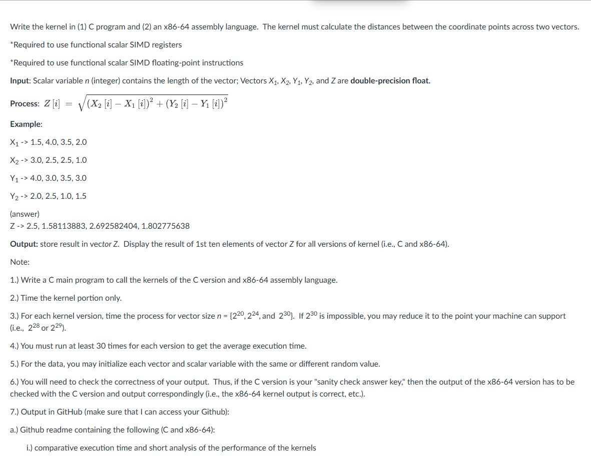
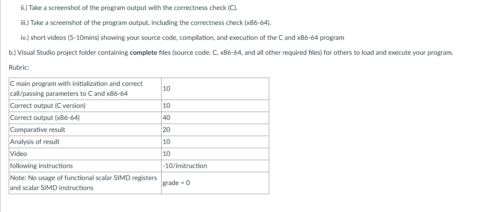
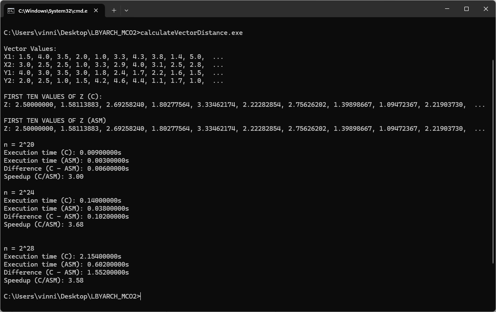
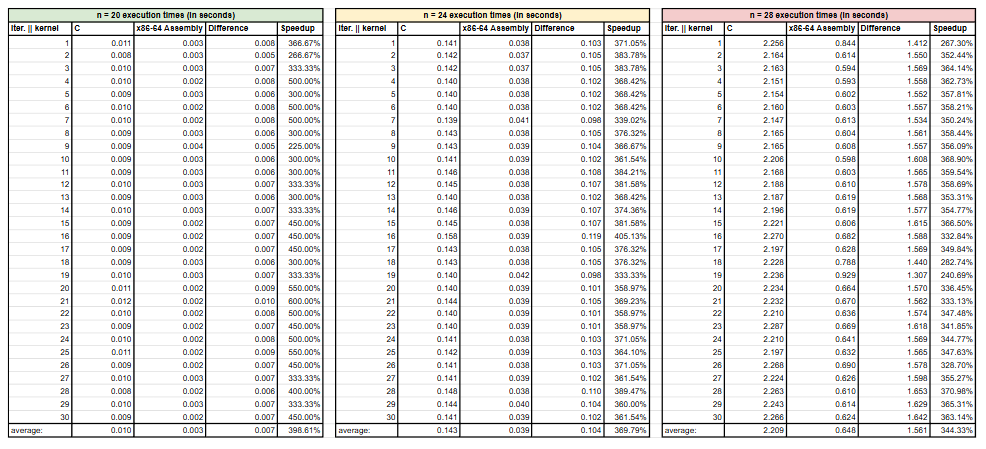

# LBYARCH S17b MCO2 - x86-to-C interface programming project (Vector Distance)

This project utilizes both C and x86-64 assembly kernels in creating a euclidean distance calculator. The perfomance of both kernels were compared, mainly through measuring their execution speeds againsts large data sizes, (vectors of n^20, n^24, n^28 elements respectively) in order to evaluate the advantages of x86-64 to C interfacing.

## Project Specifications

## Screenshots of Output

### Correctness Verification

// description
## Comparison and Analysis of Execution Times

### Execution Time Summary

### Performance Interpretation and Conclusions
## Instructions to Build and Run program

### Pre-requisites
Ensure the following tools are installed and available in PATH:

- GCC (MinGW-w64)
- NASM assembler

You may check your installation by executing "gcc --version" and "nasm --version" in your terminal

### Building the program
open the terminal and run the provided batch file `run.bat`. This script will take care of the following:
- Compiling the C file
- Assembling the .asm file
- linking everything into the final executable: `calculateVectorDistance.exe`

### Running the program
You may execute the program directly from the terminal by typing the file name of the executable.

### Expected output
Output shall display:
- First 10 values of each input vector
- First 10 values of the resulting z-vector
- Execution times of both C and ASM kernel for the following n sizes
    - n = 2^20
    - n = 2^24
    - n = 2^28
- Summary Statistics of Runtime Comparison
    - Differences in execution time
    - Speedup percentage between C and ASM interface

## Authors

- [@InoVin19](https://www.github.com/InoVin19)

